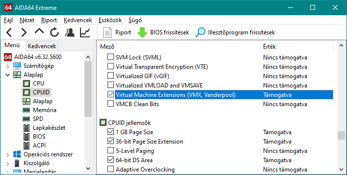
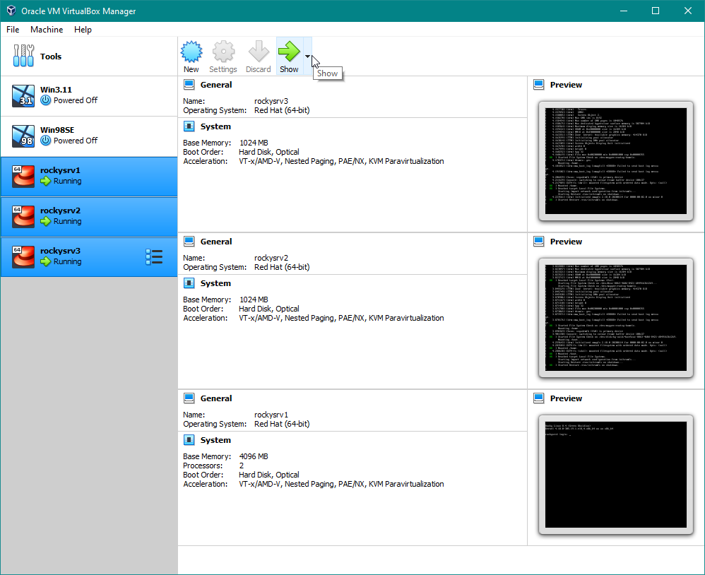
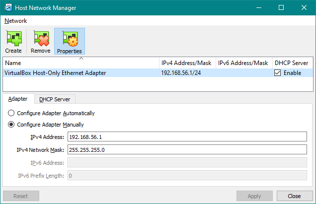
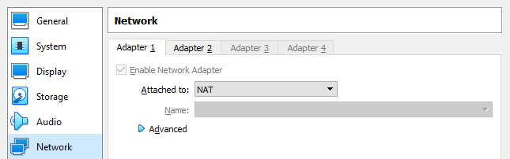
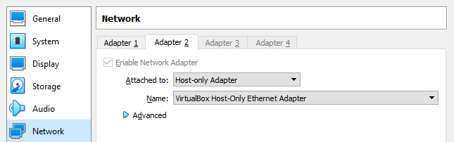
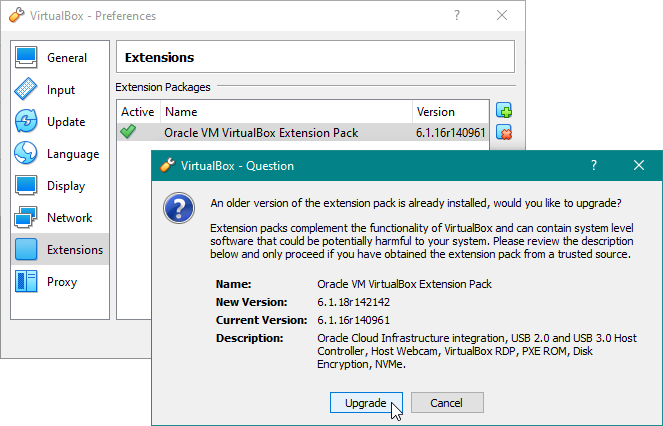
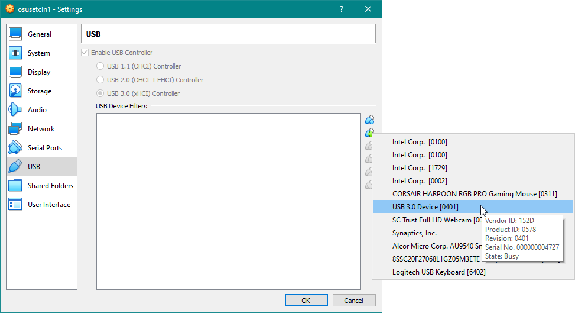
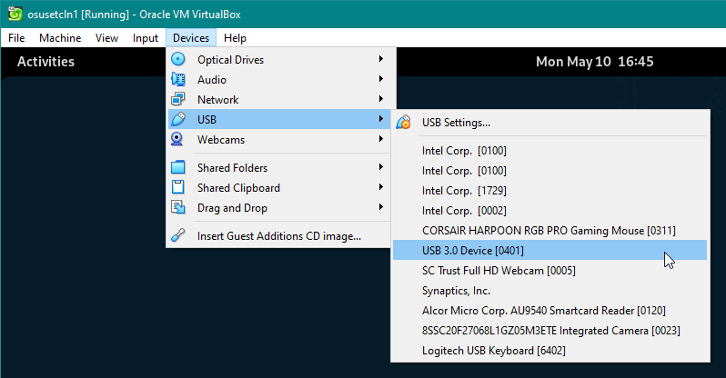
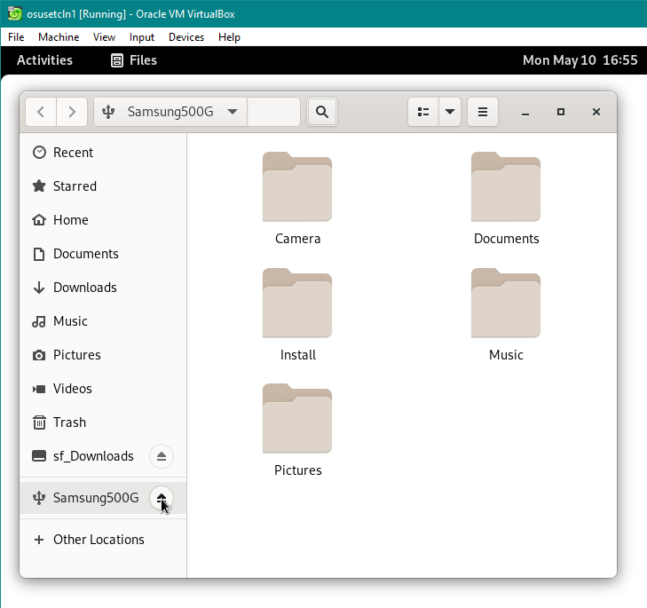

#  Oracle VM VirtualBox

###### .

>Írogatás alatt...

## Tartalomjegyzék

1. [Bevezető](#1)
2. [Telepítés](#2)
3. [VM létrehozása, alapbeállítások](#3)
4. [Guest Additions](#4)
5. [Tároló](#5)
6. [Hálózat](#6)
7. [Extension Pack](#7)
8. [Vagrant integráció](#8)

<a name="1"></a>
## 1. Bevezető

...


<a name="2"></a>
## 2. Telepítés

...

### 2.1 Előfeltételek

A BIOS-ban be kell kapcsolnunk a hardveres virtualizáció támogatását. Ezt a beállítást a "VT-x", "AMD-V", "SVM" vagy "Vanderpool" elnevezések valamelyikén kell keresnünk. 

Egy lehetséges mód a hardveres virtualizáció állapotának ellenőrzésére Windowson: 



Linux host alatt ez még ennél is egyszerűbb: 

```sh
# grep -E "svm|vmx" /proc/cpuinfo
flags           : fpu vme de pse tsc msr pae mce cx8 apic sep mtrr pge mca cmov pat pse36 clflush mmx fxsr sse sse2 ht syscall nx rdtscp lm constant_tsc rep_good nopl xtopology nonstop_tsc cpuid tsc_known_freq pni pclmulqdq monitor ds_cpl <span style="color: yellow;">vmx</span> smx est tm2 ssse3 cx16 pcid sse4_1 sse4_2 x2apic movbe popcnt aes xsave avx rdrand hypervisor lahf_lm abm 3dnowprefetch invpcid_single fsgsbase avx2 invpcid rdseed clflushopt md_clear flush_l1d arch_capabilities
flags           : fpu vme de pse tsc msr pae mce cx8 apic sep mtrr pge mca cmov pat pse36 clflush mmx fxsr sse sse2 ht syscall nx rdtscp lm constant_tsc rep_good nopl xtopology nonstop_tsc cpuid tsc_known_freq pni pclmulqdq monitor ds_cpl <span style="color: yellow;">vmx</span> smx est tm2 ssse3 cx16 pcid sse4_1 sse4_2 x2apic movbe popcnt aes xsave avx rdrand hypervisor lahf_lm abm 3dnowprefetch invpcid_single fsgsbase avx2 invpcid rdseed clflushopt md_clear flush_l1d arch_capabilities
```

### 2.2 A telepítőcsomag és esetleges függőségének beszerzése

A projekt főoldaláról is könnyen megtalálhatjuk a [Downloads](https://www.virtualbox.org/wiki/Downloads) menüpontot. Windows esetén nem is kell semmi extra. 

Linux esetében előfordulhat, hogy kelleni fog a `libvpx` csomag valamelyik verziója és még olyan is lehet, hogy külön kell keresgélnünk a fájlra. Ha már megvan, akkor könnyen megy a telepítés, majd a további, esetlegesen szükséges csomagok a kernelmodulok fordításához (a példa renszer egy openSUSE Tumbleweed): 

```sh
# zypper install libvpx4
[...]

# zypper install VirtualBox-6.1-6.1.32_149290_openSUSE150-1.x86_64.rpm
[...]

# zypper install kernel-default-devel make gcc
[...]
```

Linux alá nem `.rpm`-ből is lehet telepíteni, ha az **All distributions** opciót választjuk a [Linux Downloads](https://www.virtualbox.org/wiki/Linux_Downloads) oldalon. Ekkor a program a `/opt` alá települ (elvileg). 


### 2.3 Tesztverzió telepítése

Akár a kipróbálás (kíváncsiság) miatt, akár az elérhető legfrissebb VirtualBox verzióhoz képest még túl új Linux kernel miatt (jelen példában egy openSUSE Tumbleweed alatt voltam kénytelen ezzel küzdeni, ami egy rolling distribution), de telepíthetjük a VirtualBox testbuildját is. 

Letöltése [innen](https://www.virtualbox.org/wiki/Testbuilds) lehetséges. 


Az eredeti hiba, ami miatt legalább egyszer ilyen kiadás mellett döntöttem (a régi kernelre való visszatérés helyett): 

```sh
# /sbin/vboxconfig
vboxdrv.sh: Stopping VirtualBox services.
vboxdrv.sh: Starting VirtualBox services.
vboxdrv.sh: You must sign these kernel modules before using VirtualBox:
  vboxdrv vboxnetflt vboxnetadp
See the documentation for your Linux distribution..
vboxdrv.sh: Building VirtualBox kernel modules.
vboxdrv.sh: failed: Look at /var/log/vbox-setup.log to find out what went wrong.
[...]

# cat /var/log/vbox-setup.log
Building the main VirtualBox module.
Building the net filter module.
Error building the module:
make V=1 CONFIG_MODULE_SIG= CONFIG_MODULE_SIG_ALL= -C /lib/modules/5.18.1-1-default/build M=/tmp/vbox.0 SRCROOT=/tmp/vbox.0 -j8 modules
make[1]: warning: -j8 forced in submake: resetting jobserver mode.
make -f /usr/src/linux-5.18.1-1/scripts/Makefile.build obj=/tmp/vbox.0 \
single-build= \
[...]
/tmp/vbox.0/linux/VBoxNetFlt-linux.c: In function ‘vboxNetFltPortOsXmit’:
/tmp/vbox.0/linux/VBoxNetFlt-linux.c:2314:23: error: implicit declaration of function ‘netif_rx_ni’; did you mean ‘netif_rx’? [-Werror=implicit-function-declaration]
 2314 |                 err = netif_rx_ni(pBuf);
      |                       ^~~~~~~~~~~
      |                       netif_rx
cc1: some warnings being treated as errors
make[2]: *** [/usr/src/linux-5.18.1-1/scripts/Makefile.build:289: /tmp/vbox.0/linux/VBoxNetFlt-linux.o] Error 1
make[1]: *** [../../../linux-5.18.1-1/Makefile:1848: /tmp/vbox.0] Error 2
make: *** [/tmp/vbox.0/Makefile-footer.gmk:117: vboxnetflt] Error 2
```

A megoldás tehát az volt, hogy az épp aktuális testing verziót voltam kénytelen telepíteni, miután eltávoltítottam az eredeti, `.rpm`-ből telepítettet. 

Fontos, hogy a [talált ajánlás](https://www.techpowerup.com/forums/threads/virtualbox-on-new-kernel-5-18.295255/) szerint az **Extension Pack** is biztosan kell (ezt már a VirtualBox GUI-jából telepítettem): 

```sh
# rpm -qa | grep -i virtualbox
VirtualBox-6.1-6.1.34_150636_openSUSE150-2.x86_64

# zypper remove VirtualBox-6.1-6.1.34_150636_openSUSE150-2.x86_64
Reading installed packages...
Resolving package dependencies...
[...]

# ls -la *6.1.35*
-rw-r--r-- 1 gjakab users  11017381 Jun  8 15:44 Oracle_VM_VirtualBox_Extension_Pack-6.1.35-151571.vbox-extpack
-rwxr-xr-x 1 gjakab users 112946649 Jun  8 15:48 VirtualBox-6.1.35-151573-Linux_amd64.run

# ./VirtualBox-6.1.35-151573-Linux_amd64.run
Verifying archive integrity... All good.
Uncompressing VirtualBox for Linux installation.............
VirtualBox Version 6.1.35 r151573 (2022-05-25T12:09:26Z) installer
Installing VirtualBox to /opt/VirtualBox
Python found: python2.7, installing bindings...
[...]
We hope that you enjoy using VirtualBox.

# /sbin/vboxconfig
vboxdrv.sh: Stopping VirtualBox services.
vboxdrv.sh: Starting VirtualBox services.
vboxdrv.sh: You must sign these kernel modules before using VirtualBox:
  vboxdrv vboxnetflt vboxnetadp
See the documentation for your Linux distribution..
vboxdrv.sh: Building VirtualBox kernel modules.

# logout

~> VBoxManage startvm --type headless rockysrv1
Waiting for VM "rockysrv1" to power on...
VM "rockysrv1" has been successfully started.
```


<a name="3"></a>
## 3. VM létrehozása, alapbeállítások

...

### 3.1

...

### 3.2 Multiple preview

Ha már megfelelő beállításokkal bír egy vagy több VM-ünk és egyébként is csak konzolos belépéssel használnánk, amit meg tudunk oldani akár egy PuTTY-on át való SSH-s kapcsolódással, érdemes használnunk a Headless Start módot. Még ilyenkor is kapunk egy preview-t a VirtualBox fő ablakában. Sőt, akár az összes futó VM-ünket kiválasztva egyszerre is láthatjuk ezeket a preview-kat: 



### 3.3 A `VboxManage` program

...

Windowson a `C:\Program Files\Oracle\VirtualBox` könyvtárba kell váltanunk, onnan futtathatjuk többek között a `VBoxManage.exe`-t. 

Verzió, Windows alatt: 

<pre class="con">
C:\Users\gjakab> cd "\Program Files\Oracle\VirtualBox"

C:\Program Files\Oracle\VirtualBox> VBoxManage --version
6.1.18r142142
</pre>

VM-ek **kilistázása**: 

<pre class="con">
C:\Program Files\Oracle\VirtualBox> VBoxManage list vms
"Win98SE" {e462926a-57d2-4f77-a64d-a6d85746d6d1}
"Win3.11" {550e414a-6745-4893-a5e3-ed887bebad8d}
"rockysrv1" {9c38b4d2-1501-431a-b329-769e16be8f9e}
</pre>

VM **indítása** headless módban, amelynek köszönhetően el sem kell indítanunk a VirtualBox GUI-ját: 

<pre class="con">
C:\Program Files\Oracle\VirtualBox> VBoxManage startvm --type headless rockysrv1
Waiting for VM "rockysrv1" to power on...
VM "rockysrv1" has been successfully started.
</pre>

A `VBoxManage` más egyéb parancsokkal együtt Linuxon egyébként csak egy link az `/usr/bin/VBox` binárisra: 

<pre class="con">
$ ls -lai /usr/bin/VBox*
1070205 -rwxr-xr-x 1 root root  4677 Jul 16  2021 /usr/bin/VBox
1070206 lrwxrwxrwx 1 root root     4 Jan 13 22:22 /usr/bin/VBoxAutostart -> VBox
1070207 lrwxrwxrwx 1 root root     4 Jan 13 22:22 /usr/bin/VBoxBalloonCtrl -> VBox
1070208 lrwxrwxrwx 1 root root     4 Jan 13 22:22 /usr/bin/VBoxBugReport -> VBox
1070209 lrwxrwxrwx 1 root root     4 Jan 13 22:22 /usr/bin/VBoxDTrace -> VBox
1070210 lrwxrwxrwx 1 root root     4 Jan 13 22:22 /usr/bin/VBoxHeadless -> VBox
1070211 lrwxrwxrwx 1 root root     4 Jan 13 22:22 /usr/bin/VBoxManage -> VBox
1070212 lrwxrwxrwx 1 root root     4 Jan 13 22:22 /usr/bin/VBoxSDL -> VBox
1070213 -rwxr-xr-x 1 root root 10456 Jan 13 22:22 /usr/bin/VBoxTunctl
1070214 lrwxrwxrwx 1 root root     4 Jan 13 22:22 /usr/bin/VBoxVRDP -> VBox
</pre>

VM reset-elése (mintha csak megnyomtuk volna a gép "Reset" gombját, tehát ez a "hideg" újraindítás): 

<pre class="con">
$ VBoxManage controlvm rockysrv1 reset
</pre>


A fenti, "headless" módban való indításhoz rendelkezésünkre áll egy rövidebb parancs is, a `VBoxHeadless`. Ez mindaddig "fogja" a promptot, amíg a VM fut, a [Ctrl+C] megnyomása esetén pedig alvó állapotba helyezi a VM-et: 

<pre class="con">
$ VBoxHeadless --startvm rockysrv1
Oracle VM VirtualBox Headless Interface 6.1.32
(C) 2008-2022 Oracle Corporation
All rights reserved.

Starting virtual machine: 10%...20%...30%...40%...50%...60%...70%...80%...90%...100%
^CSaving the execution state of the virtual machine: 10%...20%...30%...40%...50%...60%...70%...80%...90%...100%
</pre>

A `VBoxManage` számos hasznos funkciói közül a legfontosabbakra még visszatérünk a továbbiakban. 

<a name="4"></a>
## 4. Guest Additions

A Guest Additions biztosítja a host és a guest közötti szorosabb kapcsolatot.  
Segítségével az alábbiak valósulnak meg (a teljesség igénye nélkül): 
- lesz kétirányú vágólap
- lesz megosztott könyvtár
- lesz szinkronizált idő (nélküle előfordulhat, hogy az utoljára szinkronizált időt folytatja a VM a Saved állapotból való visszahozás után)
- lesz dinamikusan változó képernyőfelbontás
- lesz megszakítás nélküli egérmutató

A támogatott guest OS-ek és azok támogatottságának szintjéről az épp aktuális lista a [VirtualBox oldalán](https://www.virtualbox.org/wiki/Guest_OSes) szintén megtalálható. 

### 4.1 Előfeltételek

A **Guest Additions** telepítése **Linux** guest alatt nem más, mint kernel modulok forrásból való fordítása, majd automata bekonfigurálása. Így aztán mindenképpen szükség van a GCC-re és a make-re, továbbá az aktuális kernelnek megfelelő "devel" (vagy "source") és "header" csomagokra: 

<pre class="con">
# rpm -qa | grep -E '^gcc|^make' | sort
gcc-8.3.1-5.1.el8.x86_64
make-4.2.1-10.el8.x86_64

# rpm -qa | grep ^kernel | grep $(uname -r) | sort
kernel-4.18.0-240.1.1.el8_3.x86_64
kernel-core-4.18.0-240.1.1.el8_3.x86_64
kernel-devel-4.18.0-240.1.1.el8_3.x86_64
kernel-headers-4.18.0-240.1.1.el8_3.x86_64
kernel-modules-4.18.0-240.1.1.el8_3.x86_64
kernel-tools-4.18.0-240.1.1.el8_3.x86_64
kernel-tools-libs-4.18.0-240.1.1.el8_3.x86_64
</pre>

**Windows NT** alapú, az 1996-os NT 4.0-nál újabb Windowst futtató VM alatt nem kell semmi további előfeltétel. A nem NT alapú Windowsok nem támogatottak, tehát ha az 1996 utáni időket tekintjük, a Windows 95 OSR2, 98, 98SE, ME közül egyik sem támogatott. 

### 4.2 Esetleges hibák

Linux guest esetében a Guest Additions telepítésekor sajnos nem ritka, hogy a VM-ben hibákkal szembesülünk, amik általában az ott félig automatikusan elkészítendő kernelmodulok fordításakor lépnek fel. 

#### 4.2.1 libelf-dev csomag hiánya

A **hiba** elég egyértelmű volt a `/var/log/vboxadd-setup.log`-ban: 

<pre class="con">
# ./VBoxLinuxAdditions.run
Verifying archive integrity... All good.
Uncompressing VirtualBox 6.1.18 Guest Additions for Linux........
VirtualBox Guest Additions installer
Removing installed version 6.1.18 of VirtualBox Guest Additions...
Copying additional installer modules ...
Installing additional modules ...
VirtualBox Guest Additions: Starting.
VirtualBox Guest Additions: Building the VirtualBox Guest Additions kernel
modules.  This may take a while.
VirtualBox Guest Additions: To build modules for other installed kernels, run
VirtualBox Guest Additions:   /sbin/rcvboxadd quicksetup &lt;version&gt;
VirtualBox Guest Additions: or
VirtualBox Guest Additions:   /sbin/rcvboxadd quicksetup all
VirtualBox Guest Additions: Building the modules for kernel
4.18.0-240.22.1.el8_3.x86_64.

VirtualBox Guest Additions: Look at /var/log/vboxadd-setup.log to find out what
went wrong
ValueError: File context for /opt/VBoxGuestAdditions-6.1.18/other/mount.vboxsf already defined
modprobe vboxguest failed
The log file /var/log/vboxadd-setup.log may contain further information.

# cat /var/log/vboxadd-setup.log
Building the main Guest Additions 6.1.18 module for kernel 4.18.0-240.22.1.el8_3.x86_64.
Error building the module.  Build output follows.
make V=1 CONFIG_MODULE_SIG= CONFIG_MODULE_SIG_ALL= -C /lib/modules/4.18.0-240.22.1.el8_3.x86_64/build M=/tmp/vbox.0 SRCROOT=/tmp/vbox.0 -j1 modules
Makefile:978: *** "Cannot generate ORC metadata for CONFIG_UNWINDER_ORC=y, please install libelf-dev, libelf-devel or elfutils-libelf-devel".  Stop.
make: *** [/tmp/vbox.0/Makefile-footer.gmk:117: vboxguest] Error 2
Could not find the X.Org or XFree86 Window System, skipping.
modprobe vboxguest failed
</pre>

A **megoldás**: telepíteni kell a libelf-dev-et (vagy ahhoz hasonlót): 

<pre class="con">
# dnf search libelf-dev
Last metadata expiration check: 0:03:29 ago on Thu 13 May 2021 11:26:59 PM CEST.
========================
Name Matched: libelf-dev 
========================
elfutils-libelf-devel.i686 : Development support for libelf
elfutils-libelf-devel.x86_64 : Development support for libelf
gcc-toolset-10-elfutils-libelf-devel.i686 : Development support for libelf
gcc-toolset-10-elfutils-libelf-devel.x86_64 : Development support for libelf
gcc-toolset-9-elfutils-libelf-devel.i686 : Development support for libelf
gcc-toolset-9-elfutils-libelf-devel.x86_64 : Development support for libelf

# dnf install elfutils-libelf-devel.x86_64
[...]
Total download size: 115 k
Installed size: 171 k
Is this ok [y/N]: y
[...]
Complete!
</pre>

Ezután lehet újra próbálni a `VBoxLinuxAdditions.run` program futtatását.

A végeredmény: 

<pre class="con">
# lsmod | grep vbox
vboxsf                 86016  1
vboxvideo              45056  0
ttm                   110592  2 vmwgfx,vboxvideo
drm_kms_helper        217088  2 vmwgfx,vboxvideo
drm                   557056  8 vmwgfx,drm_kms_helper,vboxvideo,ttm
vboxguest             385024  7 vboxsf
</pre>


<a name="5"></a>
## 5. Tároló

...

### 5.1 Diszk részleteinek lekérdezése

<pre class="con">
$ VBoxManage showhdinfo [VDI]
</pre>

Pl.:

<pre class="con">
C:\Program Files\Oracle\VirtualBox> VBoxManage showhdinfo "x:\VirtualBox VMs\CentOS-8\CentOS-8_hdisk0.vdi"
UUID:           96a01047-497a-49aa-b933-26d3baa6b9ae
Parent UUID:    base
State:          created
Type:           normal (base)
Location:       X:\VirtualBox VMs\CentOS-8\CentOS-8_hdisk0.vdi
Storage format: VDI
Format variant: dynamic default
Capacity:       10240 MBytes
Size on disk:   8412 MBytes
Encryption:     disabled
Property:       AllocationBlockSize=1048576
In use by VMs:  CentOS-8 (UUID: 38698320-5d88-468b-a217-c6c07f3a0f99)
</pre>

### 5.2 Új diszk létrehozása

Teljes elérési úttal kell hivatkozni az új fájlra, amelynek kiterjesztése `.vdi` lesz illetve alapértelmezetten dinamikus méretű a típusa. 

Új diszk létrehozása 1 GB-os mérettel, pl.: 

<pre class="con">
# VBoxManage createhd --filename /home/gjakab/VirtualBox/node1/node1_hdisk3 -size 1024
</pre>


### 5.3 Konvertálás fixed és dynamic között

Az átméretezés kizárólag dynamic méretezésű image-ekkel hajtható végre, így ha a diszk image-ed fixed, akkor azt át kell konvertálnod először. 

Ennél a műveletnél is fontos, hogy előtte biztonságosan állítsuk le a VM-et.  

A fixed formátumú dynamic-á (*Standard*-é) való konvertálásának szintaktikája: 

<pre class="con">
# VBoxManage clonehd [old-VDI] [new-VDI] --variant Standard
</pre>

Konvertálás vissza fixed formátumúra: 

<pre class="con">
# VBoxManage clonehd [old-VDI] [new-VDI] --variant Fixed
</pre>

### 5.4 Átméretezés

Ennek két előfeltétele van: 
- a diszk image dynamically-sized típusú legyen
- a VM megfelelően le legyen állítva

<pre class="con">
$ VBoxManage modifyhd [absolute path to file] --resize [new size in MB]
</pre>

### 5.5 Formátumok közötti konvertálás

Az alábbi példában a Red Hat KVM virtualizációja által használt `.qcow` diszk image-et konvertáljuk át `.vdi` formátumúvá Linux host alatt.

Ebben az esetben nincs lehetőség közvetlen konverzióra, így ezt két lépésben kell elvégezni: 
1. "idegen" formátum konvertálása `.raw` formátummá
2. konvertálás `.raw`-ból `.vdi`-be

Alapértelmezés szerint a KVM image-ek a `/var/lib/libvirt/images` alatt találhatóak, tehát válts oda, és kezdjük a folyamatot azzal, hogy meggyőződünk róla, hogy van elegendő szabad hely. Ha van, indulhat is a konverzió: 

<pre class="con">
# cd /var/lib/libvirt/images

# df -h .
[...]

# qemu-img convert -O raw diskimage.qcow2 diskimage.raw
[...]

# VBoxManage convertdd diskimage.raw diskimage.vdi
[...]
</pre>

### 5.6 Diszk UUID-jának megváltoztatása

Ez pl. egy meglévő diszk új VM-hez való klónozásakor lehet hasznos, ugyanis a VirtualBox az image fájlhoz egy UUID-t is rendel, azzal azonosítja azt, így aztán nem lehet belőle egynél több. Pl.:

<pre class="con">
C:\Program Files\Oracle\VirtualBox> VBoxManage internalcommands sethduuid "x:\VirtualBox VMs\rockysrv2\rockysrv2_hdisk0.vdi"
UUID changed to: 5edb59d2-a70d-400b-ba07-3c47ef6552cd
</pre>

<a name="6"></a>
## 6. Hálózat

### 6.1 NAT-olt és helyi hálós kiépítés egyszerre

Mindenképpen fontos ez, amennyiben szeretnéd pl. SSH-val vagy SFTP-vel is elérni a VM-edet, miközben azt is szeretnéd, hogy a netet is elérje. 

Ez akkor is hasznos lehet, ha valami különös oknál (pl. túl régi Linux disztribúció) fogva nem sikerül a shared folder modul fordítása. Shared folder nélkül pedig más mód után kell nézni a fájlok ide-oda másolgathatóságának érdekében.  

A főablak **File** → **Host Network Manager** eszközében ellenőrizd, hogy van-e **Host-Only** adaptered, az **IP** címtartomány rendben van és a **DHCP** is be van kapcsolva. Ha nincs, állítsd be: 



A gép első adaptere maradhat az alapértelmezett **NAT**: 



A második viszont **Host-Only** típusú legyen: 



A VM-ben ezután már két adaptert láthatsz IP címmel ellátva (ha nem, akkor `ifup <adapter>`): 

<pre class="con">
# ip a s
1: lo: <LOOPBACK,UP,LOWER_UP> mtu 65536 qdisc noqueue state UNKNOWN 
    link/loopback 00:00:00:00:00:00 brd 00:00:00:00:00:00
    inet 127.0.0.1/8 scope host lo
    inet6 ::1/128 scope host 
       valid_lft forever preferred_lft forever
2: eth1: <BROADCAST,MULTICAST,UP,LOWER_UP> mtu 1500 qdisc pfifo_fast state UP qlen 1000
    link/ether 08:00:27:4a:e7:93 brd ff:ff:ff:ff:ff:ff
    inet 10.0.2.15/24 brd 10.0.2.255 scope global eth1
    inet6 fe80::a00:27ff:fe4a:e793/64 scope link 
       valid_lft forever preferred_lft forever
3: eth2: <BROADCAST,MULTICAST,UP,LOWER_UP> mtu 1500 qdisc pfifo_fast state UP qlen 1000
    link/ether 08:00:27:68:49:d1 brd ff:ff:ff:ff:ff:ff
    inet 192.168.56.101/24 brd 192.168.56.255 scope global eth2
    inet6 fe80::a00:27ff:fe68:49d1/64 scope link 
       valid_lft forever preferred_lft forever
</pre>

<a name="7"></a>
## 7. Extension Pack

A csomag ugyanúgy a [VirtualBox oldaláról tölthető le](https://www.virtualbox.org/wiki/Downloads). Platformfüggetlen, ugyanis a VirtualBox az, ami megnyitja és telepíti saját maga alá. 

### 7.1 Az Extension Pack telepítése, frissítése

Ha a VirtualBox-ot úgy telepítetted, hogy társítva legyen a `.vbox-extpack`, mindössze duplán kattintani kell a fájlon és a VirtualBox máris megnyitja azt. Ha nem, akkor sincs gond, hiszen a funkció elérhető a **File** → **Preferences** → **Extensions** alatt. 

Fontos, hogy mindezt csak admin jogú felhasználóval telepítheted, vagy upgrade-elheted a korábbi verzióról. 



### 7.2 Külső USB-s eszköz VM alatti használata

Miután települt az Extension Pack, a VM akár USB 3.0-s eszközt is képes lesz kezelni. 

Az alábbi példában egy Windows 10 host alatti openSUSE VM-el fogunk dolgozni, amihez egy külső USB-s merevlemezes tárolót csatlakoztatunk. 

Először is csatlakoztassuk az eszközt. Nyissuk meg a VM beállításait, majd válasszuk ki a felismert USB-s eszközök közül a megfelelőt. 



Miután leokéztuk a VM beállításainak ablakát, a VM ablakán a **Devices** menüből is válasszuk ki ezt az eszközt: 



Az eszköz így már automatikusan megjelenik. Akár LUKS titkosított meghajtó is csatlakoztatható és használható így. 



Leválasztása a szabályos módon ajánlott először a VM ablakkezelőjében, aztán az előző lépésben látott Devices menüből. 

<a name="8"></a>
## 8. Vagrant integráció

A Vagrant egy nyíltforrású segédezköz hordozható, nagyon könnyen kezelhető fejlesztői környezetek építéséhez, karbantartásához. A VirtualBoxon kívül támogatja a KVM-et, Hyper-V-t, Docker konténereket, VMware-t és az AWS-t.

A program aktuális változatát a [vagrantup.com](https://www.vagrantup.com/downloads) oldalról tölthetjük le. A közösségi VM-ek böngészése az [app.vagrantup.com/boxes/search](https://app.vagrantup.com/boxes/search) oldalon lehetséges. 

Ha már telepítettük a VirtualBoxot és a Vagrantot, íme egy példa VirtualBox-os Rocky 8 VM image-ének letöltésére, felélesztésére, használatba vételére és Vagrant paranccsal való leállítására: 

<pre class="con">
$ vagrant box add generic/rocky8 --provider=virtualbox
==> box: Loading metadata for box 'generic/rocky8'
    box: URL: https://vagrantcloud.com/generic/rocky8
==> box: Adding box 'generic/rocky8' (v3.6.8) for provider: virtualbox
    box: Downloading: https://vagrantcloud.com/generic/boxes/rocky8/versions/3.6.8/providers/virtualbox.box
    box: Calculating and comparing box checksum...
==> box: Successfully added box 'generic/rocky8' (v3.6.8) for 'virtualbox'!

$ vagrant box list
generic/rocky8 (virtualbox, 3.6.8)

$ vagrant box add generic/rocky8 --provider=virtualbox
==> box: Loading metadata for box 'generic/rocky8'
    box: URL: https://vagrantcloud.com/generic/rocky8
==> box: Adding box 'generic/rocky8' (v3.6.8) for provider: virtualbox
    box: Downloading: https://vagrantcloud.com/generic/boxes/rocky8/versions/3.6.8/providers/virtualbox.box
    box: Calculating and comparing box checksum...
==> box: Successfully added box 'generic/rocky8' (v3.6.8) for 'virtualbox'!

$ vagrant box list
generic/rocky8 (virtualbox, 3.6.8)

$ vagrant init generic/rocky8 
`Vagrantfile` already exists in this directory. Remove it before
running `vagrant init`.

$ rm Vagrantfile

$ vagrant init generic/rocky8 

$ ls
Vagrantfile

$ vagrant up --provider=virtualbox 
Bringing machine 'default' up with 'virtualbox' provider...
==> default: Importing base box 'generic/rocky8'...
==> default: Matching MAC address for NAT networking...
==> default: Checking if box 'generic/rocky8' version '3.6.8' is up to date...
[...]
==> default: Machine booted and ready!
==> default: Checking for guest additions in VM...

$ vagrant status
[...]
default                   running (virtualbox)
[...]

$ vagrant ssh default
[vagrant@rocky8 ~]$ df -hPT
Filesystem                 Type      Size  Used Avail Use% Mounted on
devtmpfs                   devtmpfs  891M     0  891M   0% /dev
tmpfs                      tmpfs     909M     0  909M   0% /dev/shm
tmpfs                      tmpfs     909M   17M  893M   2% /run
tmpfs                      tmpfs     909M     0  909M   0% /sys/fs/cgroup
/dev/mapper/rl_rocky8-root xfs        70G  2.3G   68G   4% /
/dev/sda1                  xfs      1014M  201M  814M  20% /boot
tmpfs                      tmpfs     182M     0  182M   0% /run/user/1000
[vagrant@rocky8 ~]$ cat /etc/redhat-release 
Rocky Linux release 8.5 (Green Obsidian)
[vagrant@rocky8 ~]$ logout
Connection to 127.0.0.1 closed.

$ vagrant halt default
==> default: Attempting graceful shutdown of VM...
</pre>

A VirtualBox GUI-jában mindeközben már láthatjuk is az új VM-et, így innentől azzal is tudnánk vezérelni, konfigurálni. 
